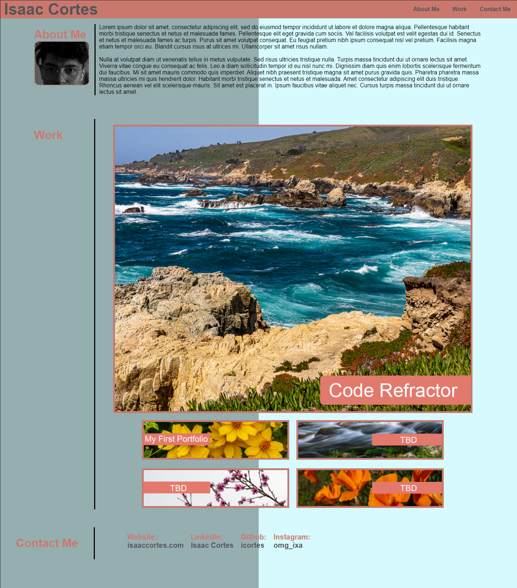

# 02 Advanced CSS: Portfolio

For this project, I had to create a portfolio webpage from scratch. A resume and cover letter are standard requirements for most job applications, but a professional portfolio will make you stand out from the rest. A portfolio of work showcases the skills and talents one has developed over time to employers trying to fill in a job position. 

## Getting Started
In this [webpage](https://icortes.github.io/my-first-portfolio/) you will find a navigation bar that will always stay on the top of the page even when you start scrolling. The navigation bar will have clickable links (About Me, Work, Contact Me) that will scroll down to the corresponding section in the page. Theres is am `About Me` section with an image of myself and some placeholder text for the time being. When you click on the images in the `Work` section it will take you to the works that I've made. At the bottom there is a `Contact Me` section with my socials and personal website.



<br>

### Prerequisites
A web browser.

### Installing
No installation required.

## Assignment
<br>

```
AS AN employer
I WANT to view a potential employee's deployed portfolio of work samples
SO THAT I can review samples of their work and assess whether they're a good candidate for an open position
```
### Acceptance Criteria

Here are the critical requirements necessary to develop a portfolio that satisfies a typical hiring manager’s needs:

```
GIVEN I need to sample a potential employee's previous work
WHEN I load their portfolio
THEN I am presented with the developer's name, a recent photo, and links to sections about them, their work, and how to contact them
WHEN I click one of the links in the navigation
THEN the UI scrolls to the corresponding section
WHEN I click on the link to the section about their work
THEN the UI scrolls to a section with titled images of the developer's applications
WHEN I am presented with the developer's first application
THEN that application's image should be larger in size than the others
WHEN I click on the images of the applications
THEN I am taken to that deployed application
WHEN I resize the page or view the site on various screens and devices
THEN I am presented with a responsive layout that adapts to my viewport
```

## Built With

* [HTML](https://developer.mozilla.org/en-US/docs/Web/HTML)
* [CSS](https://developer.mozilla.org/en-US/docs/Web/CSS)

## Deployed Link

* [My First Portfolio](https://icortes.github.io/my-first-portfolio/)


## Authors

* **Isaac Cortes Hernandez** 

- [Link to Portfolio Site](https://icortes.github.io/my-first-portfolio/)
- [Link to Github](https://github.com/icortes)
- [Link to LinkedIn](https://www.linkedin.com/in/cortes-isaac)

## License

This project is licensed under the MIT License 

## Acknowledgments

* w3schools.com
* stackoverflow.com
* css-tricks.com